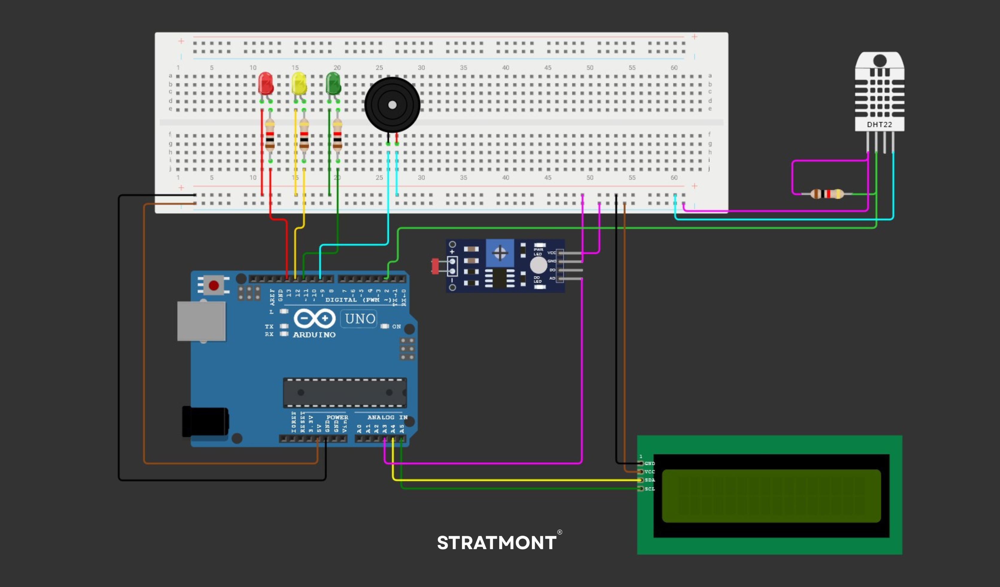

<h1 align="center">❇ Sistema de Monitoramento Ambiental para Vinhos.
</h1>

 ## ♦ Imagem Gabarito

</img>

# 📖 Descrição do Projeto

Este projeto implementa um sistema completo de monitoramento ambiental para a Vinheria Agnello, focando no controle da luminosidade, temperatura e umidade. Utilizando sensores DHT11 e um display LCD, o sistema monitora em tempo real as condições ambientais, alertando os proprietários sobre níveis críticos por meio de LEDs e um buzzer. A solução garante a preservação da qualidade dos vinhos, prevenindo danos causados por oscilações de temperatura, umidade inadequada e exposição 

# 🎯 Objetivo

- **Monitorar os níveis de luminosidade, temperatura e umidade** no ambiente da adega;
- **Informar os dados ao usuário em tempo real** através de um display LCD;
- **Emitir alertas visuais e sonoros** quando os parâmetros ambientais estiverem fora das condições ideais para conservação do vinho.

# 🔧 Funcionalidades Implementadas

1. **Luminosidade:**
   - Escuro: LED verde aceso.
   - Meia-luz: LED amarelo aceso + mensagem "Ambiente a meia luz" no display.
   - Claro: LED vermelho aceso + buzzer ativado + mensagem "Ambiente muito claro".

2. **Temperatura:**
   - Entre 10°C e 15°C: mensagem “Temperatura OK” + valor no display.
   - Abaixo de 10°C: mensagem “Temp. Baixa” + valor + buzzer + LED amarelo.
   - Acima de 15°C: mensagem “Temp. Alta” + valor + buzzer + LED amarelo.

3. **Umidade:**
   - Entre 50% e 70%: mensagem “Umidade OK” + valor no display.
   - Abaixo de 50%: mensagem “Umidade Baixa” + valor + buzzer + LED vermelho.
   - Acima de 70%: mensagem “Umidade Alta” + valor + buzzer + LED vermelho.

4. **Leitura Média:**
   - Os valores exibidos no display são calculados com base na média das últimas **5 leituras**.
   - Atualização dos dados no display a cada **5 segundos** usando `millis()`.

# 📜 Componentes Utilizados

- 1x Sensor de temperatura e umidade **DHT11**
- 1x Sensor de luminosidade (fotoresistor / LDR)
- 3x LEDs (verde, amarelo, vermelho)
- 1x Buzzer (emissor sonoro)
- 1x Display LCD (paralelo ou I2C)
- 1x Arduino UNO
- 4x Resistores diversos
- 1x Protoboard 
- 20x Jumpers

> ⚠️ Observação: foi usado o **sensor DHT22** na simulação por limitações da plataforma.

# 🔃 Como Reproduzir o Projeto

## 📜 Componentes Necessários

- Sensor de temperatura e umidade **DHT11**
- Sensor de luminosidade (fotoresistor / LDR)
- Display **LCD 16x2**
- LEDs **Vermelho, Amarelo e Verde**
- **Buzzer**
- **Arduino UNO**
- **Resistores**
- **Protoboard** e **Jumpers**

## 🔌 Montagem do Circuito

1. Conecte o **sensor DHT11** ao Arduino (pino **D2** para o sinal).
2. Conecte o **display LCD** usando o protocolo **I2C** ou diretamente nos pinos digitais do Arduino.
3. Conecte os **LEDs** nos pinos digitais **D3**, **D4** e **D5**.
4. Conecte o **buzzer** no pino digital **D6**.

## 💻 Código e Programação

1. Faça o **upload do código fonte** para o Arduino utilizando a **IDE Arduino**.
2. Certifique-se de **instalar as bibliotecas** necessárias:
   - `DHT.h`
   - `DHT_U.h`
   - `Wire.h`
   - `LiquidCrystal_I2C.h`
   - `Adafruit_Sensor.h`
 

## ✅ Testes e Verificação

- Verifique as **leituras no display LCD**.
- Simule diferentes **condições de temperatura, umidade e luminosidade** para testar os alertas:
  - LEDs indicativos
  - Sinal sonoro do buzzer

## ⚙️ Ajustes e Calibração

- No código, **ajuste os limites críticos** para definir os pontos de alerta para:
  - **Temperatura**
  - **Umidade**
  - **Luminosidade**

> 💡 Dica: Certifique-se de utilizar uma fonte de alimentação confiável para evitar variações nos sensores e alertas.

# 📎 Links

🎥 Acesse o vídeo com a explicação do projeto: [Video Explicativo](https://www.youtube.com/watch?v=vyE2ttXUoLw)  

🎥 Acesse o vídeo com a simulação do projeto: [Video Simulação](https://www.youtube.com/watch?v=DGqpybvd_rc)

📎 Acesse o projeto no Wokwi: [link para o projeto](https://wokwi.com/projects/431137025387535361)

# 📋 Desafios e Soluções

- **DHT11 fora do Tinkercad**: foi necessário usar o Wokwi e adaptar para o DHT22.
- **Precisão da média dos sensores**: implementação de arrays para armazenar múltiplas leituras.
- **Gerenciamento de tempo sem `delay()`**: uso da função `millis()` para não bloquear o loop principal.
- **Limitações visuais do LCD**: uso de mensagens curtas e claras para feedback ao usuário.

---

 

   O Código-fonte deste projeto está na pasta `/src` deste repositório. Está devidamente comentado para facilitar a compreensão da lógica e da integração com os sensores.  

   Stratmount Advisory

